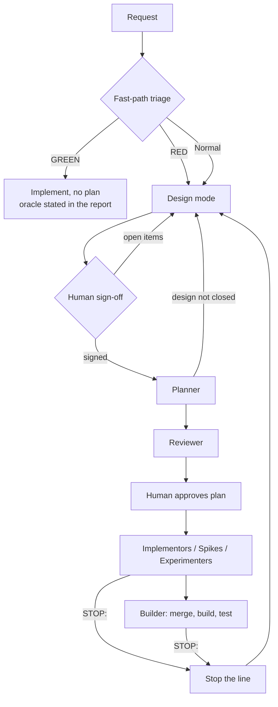

# Design Flow and Escalation Path

> A distillation of the process we run in this workspace, written to be readable by
> someone who has never seen it. It describes the rules, not our directory layout.
> The enforcing text lives in `CLAUDE.md`, `.claude/commands/orchestrate.md`, and
> the templates under `.claude/skills/orchestrate/`.

---

## 1. The problem this solves

An agent handed an under-specified task does not stop. It *decides* — picks a
format, invents an abstraction, chooses a failure policy — and then reports success.
The decision is real and load-bearing, but it was never reviewed, never recorded,
and is usually invisible in the diff. The second failure mode is the mirror image:
evidence turns up mid-implementation that contradicts the plan, and the agent works
around it rather than saying so.

Both are the same bug: **a worker resolving something that was not its to resolve.**

The flow below makes that structurally impossible by separating three modes, and
gives every agent one way out that counts as success.

## 2. Three modes, never blurred

| Mode | Question it answers | Exits on |
|------|--------------------|----------|
| **Design** | *Which mechanism?* | A human's sign-off |
| **Planning** | *Which streams, which order, which oracle?* | A reviewed plan |
| **Implementation** | *Does it work?* | Green oracle, then integration build |

Rules that hold the separation:

- **A plan is drafted only once the design is closed.** Uncertainty about the
  approach is not a reason to plan. It is a reason to ground a design. When in
  doubt, do not plan.
- **There is no Designer agent.** Design is a mode the orchestrator occupies inline.
  It uses researchers and spikes to ground a proposal, but sign-off belongs to the
  human.
- **No plan task may say "choose", "determine", or "select" an approach, or
  "design an appropriate" anything.** That phrasing is unclosed design leaking
  downstream, and it is a review failure.



## 3. Fast-path triage (before anything is drafted)

Judge complexity and blast radius first:

- **GREEN — proceed, no extra process** if either: it extends an existing design 1:1
  with no drift (pattern already solved, nothing new decided, no new storage, no new
  user-facing API interaction); or it is small enough to be provably correct from API
  surface to output (single function, simple defect fix).
- **RED — requires human input before planning** if any: new public API surface;
  breaking change to existing API; crosses multiple layers or project boundaries;
  requires new permanent data storage.
- Everything else takes the normal path: ground a design, sign off, plan.

GREEN means no plan document, never no correctness check. A GREEN change still
names the observation that proves it: the reproduction that no longer reproduces,
the fixture that round-trips, or the oracle that passes.

## 4. Design mode

Run when a change is wanted but the approach is open:

1. **Orient** — state the target outcome, hard constraints, non-goals, and sources of
   truth. Exit when the problem and important unknowns can be stated.
2. **Investigate** — ground each named unknown in code, prior art, or measurement.
   Use a spike when reading cannot settle an unknown. A spike has one named question,
   disposable code, and a hard stop after a bounded number of attempts. Its output is
   evidence plus a keep-or-discard verdict.
3. **Design** — compare at least two source-grounded options. Separate required
   properties from mechanisms. Choose provisionally and name the evidence that would
   reject the choice.
4. **Sign off** — escalate to the human with structured options. Prose is not sign-off.
5. **Record** — capture the fixed point, properties, mechanisms, rejected alternatives,
   reasons, and open questions.

Design mode is not design analysis. Analysis assesses existing code and exits with
recommendations. Design mode addresses a change not yet made and exits with a decision.

## 5. Dispatch conditions

A unit of work may be dispatched as one task only when all four conditions hold:

1. Design is settled. No open decision remains inside the task.
2. Acceptance criteria are expressible as green or red.
3. The task is verifiable against what exists today.
4. New information that invalidates the design or plan is a RED signal. Halt and
   surface it upward. Do not work around it.

Size is not a criterion. A large task is one task when nothing inside it is undecided.
A small task is not dispatchable when it contains an open failure policy.

Each stream names a local oracle: the check below end-to-end that proves its property.
Run it before the integration build. The compile-and-test suite is a late integration
test and does not replace the local oracle.

## 6. Two different escalations

| | **Ask when blocked** | **Stop the line** |
|---|---|---|
| Fires on | Absence of information | An undecided decision |
| Looks like | Contradictory requirements, unclear specification, unreachable fact | A format, abstraction, ownership rule, or failure policy nobody chose |
| Feels like | Being stuck | Being perfectly unblocked |

An agent can feel productive while resolving an undecided design question. The
reserved STOP token prevents that decision from shipping without review.

## 7. The worker side: `STOP:`

Every worker role that can encounter the situation carries a STOP THE LINE clause.
Halt edits and return immediately, without working around the issue, if:

- evidence contradicts the plan;
- the work requires touching a file outside assigned ownership, or a subsystem the
  plan did not name;
- completing the task requires choosing something the plan did not close.

Return:

```
STOP: <the violated invariant, constraint, or plan assumption>
```

Include the contradicting evidence and at least one alternative. Builders add
`needs_escalation: true`.

Escalate, never choose. A halt with evidence is a successful outcome for that
dispatch, not a failure.

The planner uses this variant when design is open:

```
design not closed: <item>; <item>
```

It writes no implementation plan until the named items receive sign-off.

## 8. The orchestrator side: routing a halt

When a worker returns `STOP:` or the orchestrator sees a contradiction:

1. Halt all implementation dispatches. State whether in-flight agents may keep
   editing. Do not allow edits when the assumption or ownership boundary is invalid.
2. Name the violated invariant. Do not restate the task more forcefully.
3. Read the relevant source directly. Do not delegate this judgment.
4. Ground a proposal and escalate to the human as a structured question with options.
   Carry the problem, decision, reason, recommendation, and alternatives.
5. Resume with a fresh agent. Record the decision in the plan or design record, state
   the superseded STOP, and dispatch the new agent with the decision as closed input.

Retry only mechanical failures such as timeouts, tooling errors, or malformed output.
Do not retry a content result that is wrong.

Classify builder escalations before dispatch. A compile error or diagnosed test break
is mechanical. A failure that needs an unclosed decision stops the line.

Missing facts need research. Missing decisions need design. Research never closes a
decision by itself.

## 9. Review catches what slipped through

Treat these as critical regardless of code quality:

- **Hidden architectural decision** — the task had to choose, determine, or select an
  approach without sign-off. Return it to Design.
- **Not transferable** — another engineer cannot continue from the plan, handoff,
  diagnostics, and tests without reconstructing the session.

Route failures by kind. Resume an implementor for a code defect. Stop the line for a
hidden decision, contradicted evidence, or scope growth.

## 10. Contradiction is not failure

Evidence that contradicts a plan is expected. Do not work around it. Escalate the
new understanding, update the living design record after the human decision, and
re-plan only the affected milestone.

Ask whether the required property was wrong or only the mechanism. Check whether a
previously rejected alternative now wins. Record what changed and preserve the
superseded reasoning.

## 11. Design record

Keep the following fields in the project design document or beads task:

```markdown
## Fixed point
<what stays true if the implementation is discarded>

## Decisions
<decision> — <evidence>. Rejected: <alternative> because <reason>.

## Invariants
<what must hold; how it is checked>

## Open questions
<question> — <experiment or measurement that would settle it>

## Disposable
<temporary scaffolding and its deletion plan>
```
